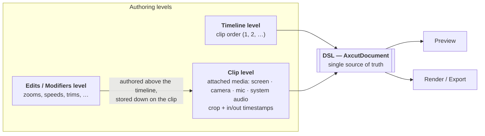

# Reorganization brief (temporary — this whole `_harvest/` directory is deleted at the end)

`./docs` has been renamed to `./technical-documentation`. Files that survive roughly as-is were
already `git mv`'d into the target skeleton. Everything in `_harvest/` is **source material to
harvest and then delete** — migration plans, merge audits, inventories of a repo we merged from,
POC stage logs, and per-task test plans for work that already shipped.

## The one rule that overrides everything

**The docs must describe this branch's code, not its history.** Before writing a sentence about
how something works, open the file that implements it and confirm. If a `_harvest/` doc says
something the code contradicts, the code wins and the doc's claim is dropped — not footnoted.

Concretely, these are the traps (all verified stale as of this branch):

| `_harvest/` says | Reality on this branch |
|---|---|
| `TimelinePane.tsx` renders the timeline | Deleted. `src/components/ai-edition/v4/V4Timeline.tsx` |
| `Titlebar` / `Bottombar` / `RightPanelStack` | Deleted. `v4/EditorTopBar.tsx` + `v4/FloatingInspector.tsx` |
| `TranscriptEditor.tsx` edits the transcript | Deleted. `CaptionsPane.tsx` + `src/lib/ai-edition/captions/` |
| `AxcutDocument` is a "v3 Zod schema" | `schemaVersion` is **5** (`src/lib/ai-edition/schema/index.ts`); v3→v4→v5 migrations live in the same file |
| the browser exporter is the export path | `exportMultiNative` via the native compositor addon |
| "the merge with Axcut", phases 0–9, `AI_FEATURES_ENABLED` rollout | The merge is done. Axcut is not a thing a reader needs to know about |

## Style contract

- **English.** Some `_harvest/` docs are in French; the output tree is English (the repo's
  README/AGENTS.md/CONTRIBUTING.md are English and this is a public repo).
- **Present tense, descriptive.** These are architecture and engineering references, not plans.
  No task tables, no `✅ done (commit abc123)` columns, no phase numbering, no "recently fixed",
  no "supersedes X". History belongs in git.
- **Keep the hard-won specifics.** Measured numbers, file:line anchors, invariants, gotchas, and
  "why not the obvious thing" notes are the whole value of these docs. Deleting the narrative
  around a measurement is right; deleting the measurement is not.
- Every doc opens with one paragraph: what this subsystem is and where its code lives.
- Close with `## Known gaps` when there are real ones (unwired capabilities, known bugs,
  platform holes). Drop anything that is already fixed.
- Cross-reference with relative links (`[document model](document-model.md)`,
  `[preview](../architecture/preview.md)`). The link checker enforces that they resolve.
- Use mermaid for diagrams (GitHub renders it). Reuse and correct the existing diagrams rather
  than inventing new notation.

## Verification gate

```bash
node scripts/check-docs.mjs
```

It enforces: every required file exists and is more than a stub, every relative link resolves,
no `docs/…` path prefixes survive, and no doc names a deleted component or a deleted doc.
`architecture/decisions.md` is the only file allowed to name removed things (that is its job).

## The diagram that was never integrated

A whiteboard diagram of the authoring levels was referenced by the old timeline doc but never
committed. Embed this mermaid **verbatim** in `architecture/overview.md`, under a heading like
`## Authoring levels`, with a short prose gloss:



The gloss must make the load-bearing point explicit: **modifiers are presented above the timeline
in the UX but stored down on the clip in the data**, which is exactly the invariant
`architecture/timeline-model.md` exists to protect.
